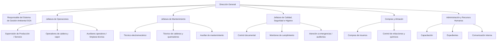

```mermaid
graph TD
    DG[Dirección General]
    
    DG --> SGA[Responsable del Sistema de Gestión Ambiental SGA]
    DG --> JefaturaOps[Jefatura de Operaciones]
    DG --> JefaturaMto[Jefatura de Mantenimiento]
    DG --> JefaturaCalidad[Jefatura de Calidad, Seguridad e Higiene]
    DG --> ComprasAlmacen[Compras y Almacén]
    DG --> AdminRRHH[Administración y Recursos Humanos]

    JefaturaOps --> Supervisión[Supervisión de Producción / Servicio]
    JefaturaOps --> Operadores[Operadores de caldera y vapor]
    JefaturaOps --> Auxiliares[Auxiliares operativos / limpieza técnica]

    JefaturaMto --> TecnicoEM[Técnico electromecánico]
    JefaturaMto --> TecnicoCal[Técnico de calderas y quemadores]
    JefaturaMto --> AuxMto[Auxiliar de mantenimiento]

    JefaturaCalidad --> ControlDoc[Control documental]
    JefaturaCalidad --> Monitoreo[Monitoreo de cumplimiento]
    JefaturaCalidad --> AtencionEmergencias[Atención a emergencias / auditorías]

    ComprasAlmacen --> ComprasIns[Compras de insumos]
    ComprasAlmacen --> ControlRef[Control de refacciones y químicos]

    AdminRRHH --> Capacitacion[Capacitación]
    AdminRRHH --> Expedientes[Expedientes]
    AdminRRHH --> ComInt[Comunicación interna]
```