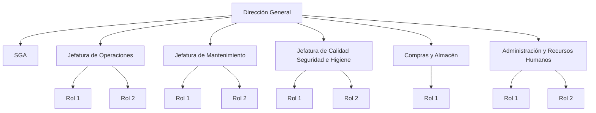

```mermaid
graph TD;
    A[Dirección General]
    B[SGA]
    C[Jefatura de Operaciones]
    D[Jefatura de Mantenimiento]
    E[Jefatura de Calidad Seguridad e Higiene]
    F[Compras y Almacén]
    G[Administración y Recursos Humanos]

    A --> B
    A --> C
    A --> D
    A --> E
    A --> F
    A --> G

    %% Level 3 roles can be added below like this:
    C1[Rol 1]
    C2[Rol 2]
    D1[Rol 1]
    D2[Rol 2]
    E1[Rol 1]
    E2[Rol 2]
    F1[Rol 1]
    G1[Rol 1]
    G2[Rol 2]

    C --> C1
    C --> C2
    D --> D1
    D --> D2
    E --> E1
    E --> E2
    F --> F1
    G --> G1
    G --> G2
```