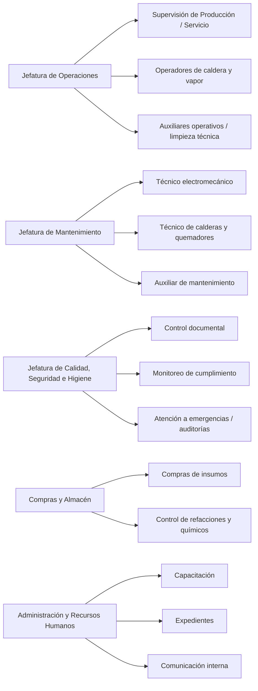

```mermaid
graph LR
    A[Jefatura de Operaciones] --> B[Supervisión de Producción / Servicio]
    A --> C[Operadores de caldera y vapor]
    A --> D[Auxiliares operativos / limpieza técnica]
    E[Jefatura de Mantenimiento] --> F[Técnico electromecánico]
    E --> G[Técnico de calderas y quemadores]
    E --> H[Auxiliar de mantenimiento]
    I[Jefatura de Calidad, Seguridad e Higiene] --> J[Control documental]
    I --> K[Monitoreo de cumplimiento]
    I --> L[Atención a emergencias / auditorías]
    M[Compras y Almacén] --> N[Compras de insumos]
    M --> O[Control de refacciones y químicos]
    P[Administración y Recursos Humanos] --> Q[Capacitación]
    P --> R[Expedientes]
    P --> S[Comunicación interna]
```